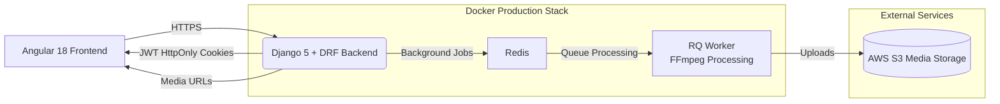

# Videoflix Backend




A production‑ready Django 5 + DRF backend powering the **Videoflix** video‑streaming platform.

- Live API: https://api.videoflix-velizar-ganchev-backend.com
- Frontend (Angular 18): https://github.com/velizarganchev/videoflix-frontend

---

## 1. Features

**Authentication & Users**  
- Registration with email confirmation link  
- Login / logout with HttpOnly JWT cookies (access + refresh)  
- Refresh endpoint with optional refresh‑token rotation + blacklist  
- Forgot‑password + reset‑password email flow  
- User profile and favorites list

**Video & Media**  
- Video model with title, description, category, thumbnail and transcoded renditions  
- Upload via Django admin (with file‑size validation)  
- Transcoding to 120p / 360p / 720p / 1080p using FFmpeg  
- Automatic thumbnail generation  
- S3 or local filesystem storage, switchable via `USE_S3_MEDIA`

**Background Jobs**  
- Redis + RQ for:
  - Transcoding
  - Thumbnail extraction
  - Cleanup of old files / renditions
  - Email sending (in production)
- Custom `SimpleWorker` class tuned for long‑running FFmpeg jobs

**Deployment & Ops**  
- Docker Compose stack for production (web, rq_worker, redis, nginx, certbot)  
- Nginx reverse proxy with HTTPS and health checks  
- AWS‑oriented configuration (EC2, RDS Postgres, S3)  
- Environment‑driven settings via `.env`

---

## 2. Architecture (High‑Level)

The backend sits between an Angular SPA frontend and the media storage (S3 or local files). Heavy work such as transcoding
is pushed to background workers so that HTTP requests stay fast.

```text
+-------------------------+
|     Angular Frontend    |
|  (videoflix-frontend)   |
+------------+------------+
             |
             | HTTPS (JWT cookies, JSON)
             v
+------------+------------+
|     Nginx Reverse Proxy |
+------------+------------+
             |
             | proxy_pass to Gunicorn
             v
+-------------------------+
|   Django + DRF Backend  |
|  (videoflix-backend)    |
+------+------+-----------+
       |      |
       |      | RQ enqueue (Redis)
       |      v
       |  +---+------------------+
       |  |  RQ Worker (FFmpeg)  |
       |  | SimpleWorker class   |
       |  +----------+-----------+
       |             |
       |             | reads/writes
       v             v
+-------------+   +-------------------+
|  Postgres   |   |  Media Storage    |
|  (RDS/dev)  |   |  S3 or local FS   |
+-------------+   +-------------------+
```

A more detailed breakdown is available in **docs/04-architecture.md**.

---

## 3. Local Development (Docker-based)

For day-to-day development the backend now runs inside Docker using the dedicated **development compose file**.
You no longer need to call `manage.py runserver` directly.

The Angular frontend still runs from its own repository (see
[videoflix-frontend](https://github.com/velizarganchev/videoflix-frontend)) and talks to the backend at
`http://127.0.0.1:8000` in dev.

### 3.1 Requirements

- Docker + Docker Compose plugin
- FFmpeg on the host (optional, the main video work happens inside the container)
- Node 20+ / Angular 18 for the separate frontend

You do **not** need a local Redis/Postgres installation for the backend; the dev stack provides Redis as a container.

### 3.2 Clone & environment

```bash
git clone https://github.com/velizarganchev/videoflix-backend.git
cd videoflix-backend

# Create a local .env from the dev template
cp .env.example.dev .env
```

The dev template is preconfigured for:

```dotenv
DEBUG=True
BACKEND_ORIGIN=http://127.0.0.1:8000

ALLOWED_HOSTS=localhost,127.0.0.1
CORS_ALLOWED_ORIGINS=http://localhost:4200
CSRF_TRUSTED_ORIGINS=http://localhost:4200

# Local media on the host, mounted into the container
USE_S3_MEDIA=False
MEDIA_URL=/media/
MEDIA_ROOT=/uploads/videos/

# Redis is provided by the dev stack and reachable via hostname "redis"
REDIS_LOCATION=redis://redis:6379/0

# In dev, emails are printed as HTML into the backend container logs
EMAIL_BACKEND=django.core.mail.backends.console.EmailBackend
```

### 3.3 Start the dev stack

Use the dedicated development compose file:

```bash
docker compose -f docker-compose.dev.yml up --build
```

This will start (at minimum):

- the Django backend (exposed on `http://127.0.0.1:8000`)
- a Redis container reachable as `redis`

Static files and media uploads are mounted from the host so you can inspect generated videos and thumbnails under
`uploads/`.

You can now run the Angular frontend from the separate repo and point it to `http://127.0.0.1:8000` as the API origin.

### 3.4 Management commands in dev

To run management commands (migrations, createsuperuser, shell, etc.) inside the running web container, use `exec`.
Assuming the web service is called `web_dev` in `docker-compose.dev.yml` (adjust if you renamed it):

```bash
# Run migrations
docker compose -f docker-compose.dev.yml exec web_dev python manage.py migrate

# Create an admin user
docker compose -f docker-compose.dev.yml exec web_dev python manage.py createsuperuser

# Open a Django shell
docker compose -f docker-compose.dev.yml exec web_dev python manage.py shell
```

### 3.5 Background jobs & Django‑RQ

For development you can either:

1. Start an RQ worker from inside the dev container, or  
2. Start it from your host, pointing it at the `redis` host.

A simple example using the dev container:

```bash
docker compose -f docker-compose.dev.yml exec web_dev   python manage.py rqworker --worker-class videoflix_backend_app.simple_worker.SimpleWorker
```

The Django‑RQ dashboard is available in dev at:

- URL: `http://127.0.0.1:8000/django-rq/`
- Requires staff/superuser login.

---

## 4. Production Deployment (Docker on EC2)

In production the backend is run inside Docker containers. A typical AWS stack looks like this:

- **EC2**: host for the Docker Compose stack (Ubuntu or similar)
- **RDS Postgres**: primary relational database
- **S3**: video + thumbnail storage  
- **Route 53 / domain**: `api.your-domain.com` → EC2 public IP
- **Security groups**: open ports 80/443 to the internet, restrict Postgres/S3/Redis appropriately

### 4.1 Environment

The repo contains a production‑oriented template `.env.example.prod`. Copy and fill it with your own values:

```bash
cp .env.example.prod .env
```

Important sections:

- `BACKEND_ORIGIN`, `ALLOWED_HOSTS`, `CSRF_TRUSTED_ORIGINS`, `CORS_ALLOWED_ORIGINS`
- `DB_*` for the RDS instance
- `REDIS_*` – in production Redis runs as a Docker service called `redis`
- `USE_S3_MEDIA=True` plus `AWS_*` keys and bucket name
- Cookie settings (`JWT_*`, CSRF/SESSION flags)

### 4.2 Bringing up the stack

On the EC2 host (after installing Docker + docker‑compose‑plugin and copying the project with `.env`):

```bash
docker compose pull web rq_worker nginx certbot_bootstrap redis
docker compose up -d --build
```

This starts:

- `web`          – Gunicorn + Django app
- `rq_worker`    – RQ worker using `SimpleWorker`
- `redis`        – Redis broker
- `nginx`        – reverse proxy + TLS termination
- `certbot_bootstrap` (one‑off) – helper service to obtain initial certificates

First‑time TLS:

```bash
docker compose run --rm certbot_bootstrap
docker compose restart nginx
```

To restart after code updates (new image pushed to registry or rebuilt on the server):

```bash
docker compose pull web rq_worker
docker compose up -d --force-recreate
```

Logs:

```bash
docker compose logs -f web
docker compose logs -f rq_worker
docker compose logs -f nginx
```

Django‑RQ dashboard in production lives under:

- `https://api.your-domain.com/django-rq/` (protected by Django admin auth).

---

## 5. Security Model (JWT + HttpOnly Cookies)

The backend uses **django‑rest‑framework‑simplejwt** together with custom helpers to keep tokens out of JavaScript:

- On login (`POST /users/login/`):
  - A **refresh token** and a short‑lived **access token** are created.
  - Tokens are written into HttpOnly cookies (`vf_refresh`, `vf_access` by default).
  - The JSON response only contains a safe public representation of the user.

- On each API call from the frontend:
  - The browser automatically sends cookies.
  - DRF + SimpleJWT read the access token from the cookie.
  - No token is stored in `localStorage` or `sessionStorage`.

- When the access token expires:
  - The frontend calls `POST /users/refresh/`.
  - If the refresh cookie is valid, a new access token is minted and written into the cookie again.
  - Optionally the refresh token is rotated and the old one blacklisted (based on `SIMPLE_JWT` settings).

- Logout (`POST /users/logout/`):
  - Attempts to blacklist the refresh token.
  - Clears both access and refresh cookies using a shared helper.

Because everything is cookie‑based, CSRF protection and `SameSite` flags are important. The templates for `.env.example.dev` and
`.env.example.prod` demonstrate good defaults (secure cookies in production, relaxed for localhost).

---

## 6. Project Structure

```text
videoflix-backend/
├─ videoflix_backend_app/      # Django project settings, URLs, WSGI, SimpleWorker
├─ users_app/                  # User model, auth views, serializers, email tasks
├─ content_app/                # Video model, API views, serializers, tasks, signals
├─ middleware/                 # Range request middleware for video streaming
├─ templates/                  # HTML email templates (confirmation, reset, etc.)
├─ static/                     # Static assets (admin tweaks, etc.)
├─ uploads/                    # Local media (dev only)
├─ docs/                       # Additional documentation (local setup, AWS, env, etc.)
├─ Dockerfile                  # Backend image (web + worker)
├─ docker-compose.yml          # Production services (web, rq_worker, redis, nginx, certbot)
├─ nginx.conf                  # Nginx reverse proxy configuration
└─ backend.entrypoint.sh       # Entrypoint used by the web & worker containers
```

---

## 7. Documentation Index

See the `docs/` folder for more detailed guides:

- `01-local-setup.md` – step‑by‑step local dev (backend + frontend)  
- `02-production-setup-aws.md` – EC2 + RDS + S3 overview and checklist  
- `03-env-files.md` – explanation of all important `.env` variables  
- `04-architecture.md` – deeper architecture & data‑flow diagram  
- `05-deployment-guide.md` – everyday Docker commands (deploy, logs, backups)  
- `06-api-reference.md` – high‑level API overview (auth + content endpoints)